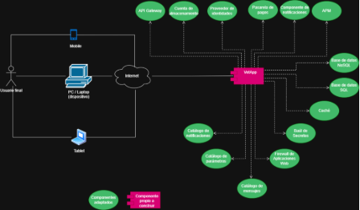
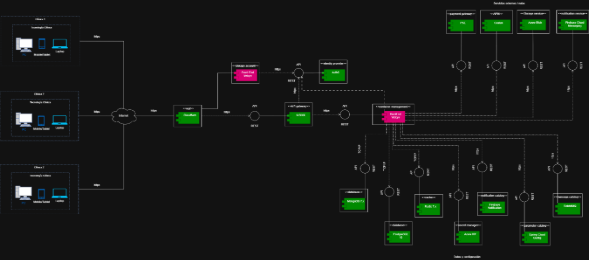
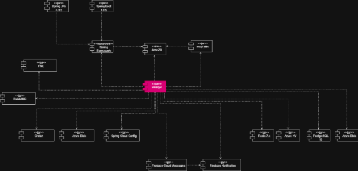
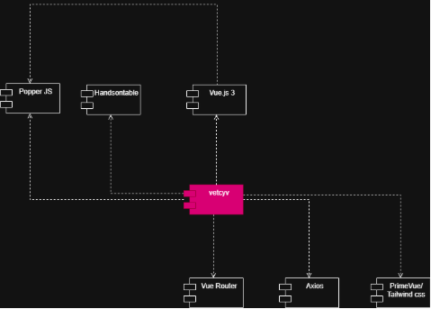
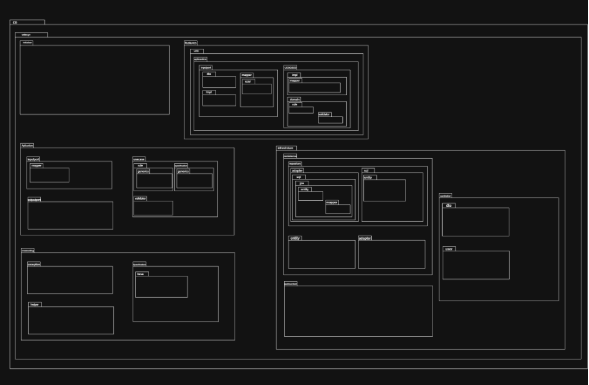
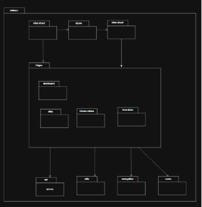
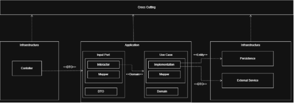
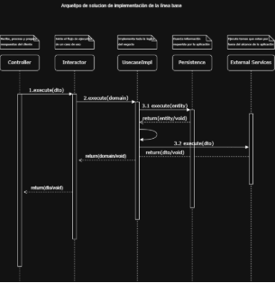
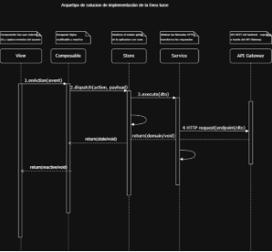

Documento de Arquitectura de Software (DAS)

**Proyecto**

Vetecyv

**Arquitectos**

Clara Isabel Rivillas Monsalve

# Control de cambios y revisiones

|**Versión**|**Fecha**|**Tipo**|**Descripción**|**Autor**|
| - | - | - | - | - |
|**1**|16/04/2026|Creación|Versión inicial del documento|Clara Rivillas|
|**2**|15/04/2026|Revisión|Se registran novedades de la revisión|Clara Rivillas|
|**3**|18/05/2026|Aprobación|Aprobación versión 3 del documento|Clara Rivillas|

# Contenido
[Control de cambios y revisiones	2](#_toc149220449)

[1.	Propósito del proyecto	14](#_toc149220450)

[2.	Motivadores de la arquitectura	14](#_toc149220451)

[2.1	Restricciones técnicas	14](#_toc149220452)

[2.2	Restricciones de negocio	14](#_toc149220453)

[2.3	Atributos de calidad	14](#_toc149220454)

[2.3.1	Atributo calidad 1	14](#_toc149220455)

[2.3.1.1	Característica 1	14](#_toc149220456)

[2.3.1.1.1	Escenario de calidad 1	14](#_toc149220457)

[2.3.1.1.2	Escenario de calidad 2	14](#_toc149220458)

[2.3.1.1.3	Escenario de calidad 3	14](#_toc149220459)

[2.3.1.1.N Escenario de calidad N	14](#_toc149220460)

[2.3.1.2	Característica 2	15](#_toc149220461)

[2.3.1.2.1	Escenario de calidad 1	15](#_toc149220462)

[2.3.1.2.2	Escenario de calidad 2	15](#_toc149220463)

[2.3.1.2.3	Escenario de calidad 3	15](#_toc149220464)

[2.3.1.2.N Escenario de calidad N	15](#_toc149220465)

[2.3.2	Atributo calidad 2	15](#_toc149220466)

[2.3.2.1	Característica 1	15](#_toc149220467)

[2.3.2.1.1	Escenario de calidad 1	15](#_toc149220468)

[2.3.2.1.2	Escenario de calidad 2	15](#_toc149220469)

[2.3.2.1.3	Escenario de calidad 3	15](#_toc149220470)

[2.3.2.1.N Escenario de calidad N	15](#_toc149220806)

[2.3.2.2	Característica 2	15](#_toc149220807)

[2.3.2.2.1	Escenario de calidad 1	16](#_toc149220808)

[2.3.2.2.2	Escenario de calidad 2	16](#_toc149220809)

[2.3.2.2.3	Escenario de calidad 3	16](#_toc149220810)

[2.3.2.1.N Escenario de calidad N	16](#_toc149220811)

[2.4	Funcionalidades críticas	16](#_toc149220812)

[3.	Tácticas y estrategias	16](#_toc149220813)

[4.	Modelo de contexto	16](#_toc149220814)

[5.	Arquetipo de solución/referencia	16](#_toc149220815)

[6.	Arquitectura de solución/referencia	16](#_toc149220816)

[7.	Línea base arquitectónica	16](#_toc149220817)

[7.1	Línea base arquitectónica de componentes	17](#_toc149220818)

[7.1.1	Componente 1	17](#_toc149220819)

[7.1.2	Componente 1	17](#_toc149220820)

[7.2	Estilos y patrones arquitectónicos adoptados	17](#_toc149220821)

[7.2.1	Estilo arquitectónico 1	17](#_toc149220822)

[7.2.1.1	Nombre	17](#_toc149220823)

[7.2.1.2	Problema	17](#_toc149220824)

[7.2.1.3	Solución/Motivación	17](#_toc149220825)

[7.2.2	Estilo arquitectónico 2	17](#_toc149220826)

[7.2.2.1	Nombre	17](#_toc149220827)

[7.2.2.2	Problema	17](#_toc149220828)

[7.2.2.3	Solución/Motivación	17](#_toc149220829)

[7.2.N Estilo arquitectónico 2	17](#_toc149220830)

[7.2.N.1 Nombre	17](#_toc149220831)

[7.2.N.2 Problema	18](#_toc149220832)

[7.2.N.3 Solución/Motivación	18](#_toc149220833)

[8.	Justificación alternativa de solución	18](#_toc149220834)

[8.1	Justificación	18](#_toc149220835)

[8.2	Ventajas	18](#_toc149220836)

[8.3	Desventajas	18](#_toc149220837)

[9.	Vistas de arquitectura del sistema	18](#_toc149220838)

[9.1	Vista Funcional/Vista de Escenarios/Vista de Casos de Uso	18](#_toc149220839)

[9.1.1	Modelo de procesos del negocio	18](#_toc149220840)

[9.1.2	Modelado de dominio	18](#_toc149220841)

[9.1.3	Modelo de contextos	18](#_toc149220842)

[9.1.3.1	Diagrama	18](#_toc149220843)

[9.1.3.2	Documentación contextos	18](#_toc149220844)

[9.1.4	Modelo de mapeo de contextos	19](#_toc149220845)

[9.1.4.1	Diagrama	19](#_toc149220846)

[9.1.4.2	Documentación mapeo de contextos	19](#_toc149220847)

[9.1.5	Modelos de dominio	19](#_toc149220848)

[9.1.5.1	Contexto 1	19](#_toc149220849)

[9.1.5.2	Modelo anémico	19](#_toc149220850)

[9.1.5.3	Modelo enriquecido	19](#_toc149220851)

[9.1.5.4	Contexto 2	19](#_toc149220852)

[9.1.5.5	Modelo anémico	19](#_toc149220853)

[9.1.5.6	Modelo enriquecido	19](#_toc149220854)

[9.1.5.7	Contexto 3	19](#_toc149220855)

[9.1.5.8	Modelo anémico	20](#_toc149220856)

[9.1.5.9	Modelo enriquecido	20](#_toc149220857)

[9.1.5.10	Contexto N	20](#_toc149220858)

[9.1.5.11	Modelo anémico	20](#_toc149220859)

[9.1.5.12	Modelo enriquecido	20](#_toc149220860)

[9.1.6	Flujo de eventos/Event Storming	20](#_toc149220861)

[9.1.6.1	Diagrama	20](#_toc149220862)

[9.1.6.2	Especificación	20](#_toc149220863)

[9.1.7	Glosario de términos del negocio	20](#_toc149220864)

[9.1.8	Especificación de requisitos de software	20](#_toc149220865)

[9.1.8.1	Requisitos de usuario	20](#_toc149220866)

[9.1.8.2	Requisitos del sistema	21](#_toc149220867)

[9.1.8.2.1	Requisitos funcionales	21](#_toc149220868)

[9.1.8.2.2	Requisitos no funcionales	21](#_toc149220869)

[9.1.8.2.3	Requisitos de información	21](#_toc149220870)

[9.1.8.2.4	Reglas de negocio	21](#_toc149220871)

[9.1.9	Casos de uso	21](#_toc149220872)

[9.1.9.1	Modelo de contexto	21](#_toc149220873)

[9.1.9.1.1	Diagrama	21](#_toc149220874)

[9.1.9.1.2	Descripción	21](#_toc149220875)

[9.1.9.2	Diagramas de casos de uso	21](#_toc149220876)

[9.1.9.2.1	Componente 1/Módulo 1/Grupo 1	21](#_toc149220877)

[9.1.9.2.1.1	Diagrama de casos de uso	22](#_toc149220878)

[9.1.9.2.1.2	Especificación de casos de uso	22](#_toc149220879)

[9.1.9.2.1.2.1	Caso de uso 1	22](#_toc149220880)

[9.1.9.2.1.2.1.1	Datos básicos caso de uso	22](#_toc149220881)

[9.1.9.2.1.2.1.2	Escenarios del caso de uso	22](#_toc149220882)

[9.1.9.2.1.2.1.3	Flujo normal/flujo básico	22](#_toc149220883)

[9.1.9.2.1.2.1.4	Flujo alterno 1	22](#_toc149220884)

[9.1.9.2.1.2.1.5	Flujo alterno 2	22](#_toc149220885)

[9.1.9.2.1.2.1.6	Flujo alterno N	22](#_toc149220886)

[9.1.9.2.1.2.1.7	Flujo Excepcional 1	22](#_toc149220887)

[9.1.9.2.1.2.1.8	Flujo Excepcional 2	22](#_toc149220888)

[9.1.9.2.1.2.1.9	Flujo Excepcional N	22](#_toc149220889)

[9.1.9.2.1.2.1.10	Diagrama de actividades	22](#_toc149220890)

[9.1.9.2.1.2.1.10.1	Diagrama	23](#_toc149220891)

[9.1.9.2.1.2.1.10.2	Documentación	23](#_toc149220892)

[9.1.9.2.1.2.1.11	Diagrama de estados	23](#_toc149220893)

[9.1.9.2.1.2.1.11.1	Diagrama	23](#_toc149220894)

[9.1.9.2.1.2.1.11.2	Documentación	23](#_toc149220895)

[9.1.9.2.1.2.2	Caso de uso 2	23](#_toc149220896)

[9.1.9.2.1.2.2.1	Datos básicos caso de uso	23](#_toc149220897)

[9.1.9.2.1.2.2.2	Escenarios del caso de uso	23](#_toc149220898)

[9.1.9.2.1.2.2.3	Flujo normal/flujo básico	23](#_toc149220899)

[9.1.9.2.1.2.2.4	Flujo alterno 1	23](#_toc149220900)

[9.1.9.2.1.2.2.5	Flujo alterno 2	23](#_toc149220901)

[9.1.9.2.1.2.2.6	Flujo alterno N	23](#_toc149220902)

[9.1.9.2.1.2.2.7	Flujo Excepcional 1	23](#_toc149220903)

[9.1.9.2.1.2.2.8	Flujo Excepcional 2	23](#_toc149220904)

[9.1.9.2.1.2.2.9	Flujo Excepcional N	24](#_toc149220905)

[9.1.9.2.1.2.2.10	Diagrama de actividades	24](#_toc149220906)

[9.1.9.2.1.2.2.10.1	Diagrama	24](#_toc149220907)

[9.1.9.2.1.2.2.10.2	Documentación	24](#_toc149220908)

[9.1.9.2.1.2.2.11	Diagrama de estados	24](#_toc149220909)

[9.1.9.2.1.2.2.11.1	Diagrama	24](#_toc149220910)

[9.1.9.2.1.2.2.11.2	Documentación	24](#_toc149220911)

[9.1.9.2.1.2.3	Caso de uso N	24](#_toc149220912)

[9.1.9.2.1.2.3.1	Datos básicos caso de uso	24](#_toc149220913)

[9.1.9.2.1.2.3.2	Escenarios del caso de uso	24](#_toc149220914)

[9.1.9.2.1.2.3.3	Flujo normal/flujo básico	24](#_toc149220915)

[9.1.9.2.1.2.3.4	Flujo alterno 1	24](#_toc149220916)

[9.1.9.2.1.2.3.5	Flujo alterno 2	24](#_toc149220917)

[9.1.9.2.1.2.3.6	Flujo alterno N	24](#_toc149220918)

[9.1.9.2.1.2.3.7	Flujo Excepcional 1	25](#_toc149220919)

[9.1.9.2.1.2.3.8	Flujo Excepcional 2	25](#_toc149220920)

[9.1.9.2.1.2.3.9	Flujo Excepcional N	25](#_toc149220921)

[9.1.9.2.1.2.3.10	Diagrama de actividades	25](#_toc149220922)

[9.1.9.2.1.2.3.10.1	Diagrama	25](#_toc149220923)

[9.1.9.2.1.2.3.10.2	Documentación	25](#_toc149220924)

[9.1.9.2.1.2.3.11	Diagrama de estados	25](#_toc149220925)

[9.1.9.2.1.2.3.11.1	Diagrama	25](#_toc149220926)

[9.1.9.2.1.2.3.11.2	Documentación	25](#_toc149220927)

[9.1.9.2.2	Componente 2/Módulo 2/Grupo 2	25](#_toc149220928)

[9.1.9.2.2.1	Diagrama de casos de uso	25](#_toc149220929)

[9.1.9.2.2.2	Especificación de casos de uso	25](#_toc149220930)

[9.1.9.2.2.2.1	Caso de uso 1	25](#_toc149220931)

[9.1.9.2.2.2.1.1	Datos básicos caso de uso	25](#_toc149220932)

[9.1.9.2.2.2.1.2	Escenarios del caso de uso	26](#_toc149220933)

[9.1.9.2.2.2.1.3	Flujo normal/flujo básico	26](#_toc149220934)

[9.1.9.2.2.2.1.4	Flujo alterno 1	26](#_toc149220935)

[9.1.9.2.2.2.1.5	Flujo alterno 2	26](#_toc149220936)

[9.1.9.2.2.2.1.6	Flujo alterno N	26](#_toc149220937)

[9.1.9.2.2.2.1.7	Flujo Excepcional 1	26](#_toc149220938)

[9.1.9.2.2.2.1.8	Flujo Excepcional 2	26](#_toc149220939)

[9.1.9.2.2.2.1.9	Flujo Excepcional N	26](#_toc149220940)

[9.1.9.2.2.2.1.10	Diagrama de actividades	26](#_toc149220941)

[9.1.9.2.2.2.1.10.1	Diagrama	26](#_toc149220942)

[9.1.9.2.2.2.1.10.2	Documentación	26](#_toc149220943)

[9.1.9.2.2.2.1.11	Diagrama de estados	26](#_toc149220944)

[9.1.9.2.2.2.1.11.1	Diagrama	26](#_toc149220945)

[9.1.9.2.2.2.1.11.2	Documentación	26](#_toc149220946)

[9.1.9.2.2.2.2	Caso de uso 2	27](#_toc149220947)

[9.1.9.2.2.2.2.1	Datos básicos caso de uso	27](#_toc149220948)

[9.1.9.2.2.2.2.2	Escenarios del caso de uso	27](#_toc149220949)

[9.1.9.2.2.2.2.3	Flujo normal/flujo básico	27](#_toc149220950)

[9.1.9.2.2.2.2.4	Flujo alterno 1	27](#_toc149220951)

[9.1.9.2.2.2.2.5	Flujo alterno 2	27](#_toc149220952)

[9.1.9.2.2.2.2.6	Flujo alterno N	27](#_toc149220953)

[9.1.9.2.2.2.2.7	Flujo Excepcional 1	27](#_toc149220954)

[9.1.9.2.2.2.2.8	Flujo Excepcional 2	27](#_toc149220955)

[9.1.9.2.2.2.2.9	Flujo Excepcional N	27](#_toc149220956)

[9.1.9.2.2.2.2.10	Diagrama de actividades	27](#_toc149220957)

[9.1.9.2.2.2.2.10.1	Diagrama	27](#_toc149220958)

[9.1.9.2.2.2.2.10.2	Documentación	27](#_toc149220959)

[9.1.9.2.2.2.2.11	Diagrama de estados	28](#_toc149220960)

[9.1.9.2.2.2.2.11.1	Diagrama	28](#_toc149220961)

[9.1.9.2.2.2.2.11.2	Documentación	28](#_toc149220962)

[9.1.9.2.2.2.3	Caso de uso N	28](#_toc149220963)

[9.1.9.2.2.2.3.1	Datos básicos caso de uso	28](#_toc149220964)

[9.1.9.2.2.2.3.2	Escenarios del caso de uso	28](#_toc149220965)

[9.1.9.2.2.2.3.3	Flujo normal/flujo básico	28](#_toc149220966)

[9.1.9.2.2.2.3.4	Flujo alterno 1	28](#_toc149220967)

[9.1.9.2.2.2.3.5	Flujo alterno 2	28](#_toc149220968)

[9.1.9.2.2.2.3.6	Flujo alterno N	28](#_toc149220969)

[9.1.9.2.2.2.3.7	Flujo Excepcional 1	28](#_toc149220970)

[9.1.9.2.2.2.3.8	Flujo Excepcional 2	28](#_toc149220971)

[9.1.9.2.2.2.3.9	Flujo Excepcional N	28](#_toc149220972)

[9.1.9.2.2.2.3.10	Diagrama de actividades	29](#_toc149220973)

[9.1.9.2.2.2.3.10.1	Diagrama	29](#_toc149220974)

[9.1.9.2.2.2.3.10.2	Documentación	29](#_toc149220975)

[9.1.9.2.2.2.3.11	Diagrama de estados	29](#_toc149220976)

[9.1.9.2.2.2.3.11.1	Diagrama	29](#_toc149220977)

[9.1.9.2.2.2.3.11.2	Documentación	29](#_toc149220978)

[9.1.9.2.3	Componente N/Módulo N/Grupo N	29](#_toc149220979)

[9.1.9.2.3.1	Diagrama de casos de uso	29](#_toc149220980)

[9.1.9.2.3.2	Especificación de casos de uso	29](#_toc149220981)

[9.1.9.2.3.2.1	Caso de uso 1	29](#_toc149220982)

[9.1.9.2.3.2.1.1	Datos básicos caso de uso	29](#_toc149220983)

[9.1.9.2.3.2.1.2	Escenarios del caso de uso	29](#_toc149220984)

[9.1.9.2.3.2.1.3	Flujo normal/flujo básico	29](#_toc149220985)

[9.1.9.2.3.2.1.4	Flujo alterno 1	29](#_toc149220986)

[9.1.9.2.3.2.1.5	Flujo alterno 2	30](#_toc149220987)

[9.1.9.2.3.2.1.6	Flujo alterno N	30](#_toc149220988)

[9.1.9.2.3.2.1.7	Flujo Excepcional 1	30](#_toc149220989)

[9.1.9.2.3.2.1.8	Flujo Excepcional 2	30](#_toc149220990)

[9.1.9.2.3.2.1.9	Flujo Excepcional N	30](#_toc149220991)

[9.1.9.2.3.2.1.10	Diagrama de actividades	30](#_toc149220992)

[9.1.9.2.3.2.1.10.1	Diagrama	30](#_toc149220993)

[9.1.9.2.3.2.1.10.2	Documentación	30](#_toc149220994)

[9.1.9.2.3.2.1.11	Diagrama de estados	30](#_toc149220995)

[9.1.9.2.3.2.1.11.1	Diagrama	30](#_toc149220996)

[9.1.9.2.3.2.1.11.2	Documentación	30](#_toc149220997)

[9.1.9.2.3.2.2	Caso de uso 2	30](#_toc149220998)

[9.1.9.2.3.2.2.1	Datos básicos caso de uso	30](#_toc149220999)

[9.1.9.2.3.2.2.2	Escenarios del caso de uso	30](#_toc149221000)

[9.1.9.2.3.2.2.3	Flujo normal/flujo básico	31](#_toc149221001)

[9.1.9.2.3.2.2.4	Flujo alterno 1	31](#_toc149221002)

[9.1.9.2.3.2.2.5	Flujo alterno 2	31](#_toc149221003)

[9.1.9.2.3.2.2.6	Flujo alterno N	31](#_toc149221004)

[9.1.9.2.3.2.2.7	Flujo Excepcional 1	31](#_toc149221005)

[9.1.9.2.3.2.2.8	Flujo Excepcional 2	31](#_toc149221006)

[9.1.9.2.3.2.2.9	Flujo Excepcional N	31](#_toc149221007)

[9.1.9.2.3.2.2.10	Diagrama de actividades	31](#_toc149221008)

[9.1.9.2.3.2.2.10.1	Diagrama	31](#_toc149221009)

[9.1.9.2.3.2.2.10.2	Documentación	31](#_toc149221010)

[9.1.9.2.3.2.2.11	Diagrama de estados	31](#_toc149221011)

[9.1.9.2.3.2.2.11.1	Diagrama	31](#_toc149221012)

[9.1.9.2.3.2.2.11.2	Documentación	31](#_toc149221013)

[9.1.9.2.3.2.3	Caso de uso N	31](#_toc149221014)

[9.1.9.2.3.2.3.1	Datos básicos caso de uso	32](#_toc149221015)

[9.1.9.2.3.2.3.2	Escenarios del caso de uso	32](#_toc149221016)

[9.1.9.2.3.2.3.3	Flujo normal/flujo básico	32](#_toc149221017)

[9.1.9.2.3.2.3.4	Flujo alterno 1	32](#_toc149221018)

[9.1.9.2.3.2.3.5	Flujo alterno 2	32](#_toc149221019)

[9.1.9.2.3.2.3.6	Flujo alterno N	32](#_toc149221020)

[9.1.9.2.3.2.3.7	Flujo Excepcional 1	32](#_toc149221021)

[9.1.9.2.3.2.3.8	Flujo Excepcional 2	32](#_toc149221022)

[9.1.9.2.3.2.3.9	Flujo Excepcional N	32](#_toc149221023)

[9.1.9.2.3.2.3.10	Diagrama de actividades	32](#_toc149221024)

[9.1.9.2.3.2.3.10.1	Diagrama	32](#_toc149221025)

[9.1.9.2.3.2.3.10.2	Documentación	32](#_toc149221026)

[9.1.9.2.3.2.3.11	Diagrama de estados	32](#_toc149221027)

[9.1.9.2.3.2.3.11.1	Diagrama	33](#_toc149221028)

[9.1.9.2.3.2.3.11.2	Documentación	33](#_toc149221029)

[9.1.10	Incepción Ágil	33](#_toc149221030)

[9.1.11	Por qué estamos aquí	33](#_toc149221031)

[9.1.12	Visión/Elevator Pitch	33](#_toc149221032)

[9.1.12.1	Visión	33](#_toc149221033)

[9.1.12.2	Project Canvas	33](#_toc149221034)

[9.1.12.3	Mapa de impacto	33](#_toc149221035)

[9.1.13	Caja de producto	33](#_toc149221036)

[9.1.14	Lo que sí, lo que no	33](#_toc149221037)

[9.1.14.1	Mapa de historias de usuario	33](#_toc149221038)

[9.1.14.2	Product Backlog Item	33](#_toc149221039)

[9.1.15	La comunidad	34](#_toc149221040)

[9.1.16	La solución	34](#_toc149221041)

[9.1.17	Los riesgos/Los miedos	34](#_toc149221042)

[9.1.18	Tamaño/Talla de historias de usuario	34](#_toc149221043)

[9.1.18.1	Tallaje del producto	34](#_toc149221044)

[9.1.18.1.1	Definiciones para el tallaje	34](#_toc149221045)

[9.1.18.1.2	Tallaje del producto	34](#_toc149221046)

[9.1.18.2	Release Plan	34](#_toc149221047)

[9.1.18.2.1	Definiciones para el release plan	34](#_toc149221048)

[9.1.18.2.2	Release plan	34](#_toc149221049)

[9.1.19	Trade off de atributos de calidad	34](#_toc149221050)

[9.1.20	Cuánto cuesta	34](#_toc149221051)

[9.1.20.1.1	Definiciones para el coste	35](#_toc149221052)

[9.1.20.1.2	Coste	35](#_toc149221053)

[9.2	Vista Lógica	35](#_toc149221054)

[9.2.1	Diagrama de clases	35](#_toc149221055)

[9.2.1.1	Componente 1	35](#_toc149221056)

[9.2.1.1.1	Diagrama	35](#_toc149221057)

[9.2.1.1.2	Documentación	35](#_toc149221058)

[9.2.1.2	Componente 2	35](#_toc149221059)

[9.2.1.2.1	Diagrama	35](#_toc149221060)

[9.2.1.2.2	Documentación	35](#_toc149221061)

[9.2.1.3	Componente N	35](#_toc149221062)

[9.2.1.3.1	Diagrama	35](#_toc149221063)

[9.2.1.3.2	Documentación	35](#_toc149221064)

[9.2.2	Diagrama de objetos	36](#_toc149221065)

[9.2.2.1	Componente 1	36](#_toc149221066)

[9.2.2.1.1	Diagrama	36](#_toc149221067)

[9.2.2.1.2	Documentación	36](#_toc149221068)

[9.2.2.2	Componente 2	36](#_toc149221069)

[9.2.2.2.1	Diagrama	36](#_toc149221070)

[9.2.2.2.2	Documentación	36](#_toc149221071)

[9.2.2.3	Componente N	36](#_toc149221072)

[9.3	Vista de Despliegue/Vista de Desarrollo/Vista de Implementación	36](#_toc149221073)

[9.3.1	Diagrama de componentes	36](#_toc149221074)

[9.3.1.1	Componente 1	36](#_toc149221075)

[9.3.1.1.1	Diagrama	36](#_toc149221076)

[9.3.1.1.2	Documentación	36](#_toc149221077)

[9.3.1.2	Componente 2	36](#_toc149221078)

[9.3.1.2.1	Diagrama	37](#_toc149221079)

[9.3.1.2.2	Documentación	37](#_toc149221080)

[9.3.1.3	Componente N	37](#_toc149221081)

[9.3.1.3.1	Diagrama	37](#_toc149221082)

[9.3.1.3.2	Documentación	37](#_toc149221083)

[9.3.2	Diagrama de paquetes	37](#_toc149221084)

[9.3.2.1	Componente 1	37](#_toc149221085)

[9.3.2.1.1	Diagrama	37](#_toc149221086)

[9.3.2.1.2	Documentación	37](#_toc149221087)

[9.3.2.2	Componente 2	37](#_toc149221088)

[9.3.2.2.1	Diagrama	37](#_toc149221089)

[9.3.2.2.2	Documentación	37](#_toc149221090)

[9.3.2.3	Componente N	37](#_toc149221091)

[9.3.2.3.1	Diagrama	37](#_toc149221092)

[9.3.2.3.2	Documentación	38](#_toc149221093)

[9.4	Vista de Procesos	38](#_toc149221094)

[9.4.1	Diagrama de secuencia	38](#_toc149221095)

[9.4.1.1	Componente 1	38](#_toc149221096)

[9.4.1.1.1	Diagrama	38](#_toc149221097)

[9.4.1.1.2	Documentación	38](#_toc149221098)

[9.4.1.2	Componente 2	38](#_toc149221099)

[9.4.1.2.1	Diagrama	38](#_toc149221100)

[9.4.1.2.2	Documentación	38](#_toc149221101)

[9.4.1.3	Componente N	38](#_toc149221102)

[9.4.1.3.1	Diagrama	38](#_toc149221103)

[9.4.1.3.2	Documentación	38](#_toc149221104)

[9.4.2	Diagrama de colaboración	38](#_toc149221105)

[9.4.2.1	Componente 1	38](#_toc149221106)

[9.4.2.1.1	Diagrama	39](#_toc149221107)

[9.4.2.1.2	Documentación	39](#_toc149221108)

[9.4.2.2	Componente 2	39](#_toc149221109)

[9.4.2.2.1	Diagrama	39](#_toc149221110)

[9.4.2.2.2	Documentación	39](#_toc149221111)

[9.4.2.3	Componente N	39](#_toc149221112)

[9.4.2.3.1	Diagrama	39](#_toc149221113)

[9.4.2.3.2	Documentación	39](#_toc149221114)

[9.5	Vista Física/Vista de Implantación	39](#_toc149221115)

[9.5.1	Diagrama de despliegue	39](#_toc149221116)

[9.5.1.1	Diagrama	39](#_toc149221117)

[9.5.1.2	Documentación	39](#_toc149221118)

1. # Propósito del proyecto
2. # Motivadores de la arquitectura
Llas restricciones técnicas (tecnologías, prácticas y estándares que el equipo debe seguir), las restricciones de negocio (limitaciones humanas, de tiempo, presupuesto, legales y de procesos), y los atributos de calidad (propiedades que el sistema debe exhibir para satisfacer las necesidades de sus usuarios). Juntos, estos elementos guían la selección de estilos arquitectónicos, patrones de diseño y estrategias de implementación a lo largo del proyecto.

2.1. ## Restricciones técnicas
Las restricciones técnicas son condiciones no negociables de tipo tecnológico que enmarcan el diseño y desarrollo del sistema. En Vetecyv se han definido las siguientes restricciones técnicas: (1) Prácticas de diseño: el sistema debe seguir los principios SOLID, el Manifiesto de Aplicaciones Reactivas y el Well-Architected Framework. (2) Marco metodológico: se utiliza SCRUM para el desarrollo ágil. (3) Prácticas DevOps: se propende por prácticas DevOps y la adopción de los 12 factores de aplicación (más los 3 extendidos). (4) Código limpio: se aplican prácticas de Clean Code evitando Messy Code y Code Smells. (5) Patrones de diseño: se usan patrones GoF, GRASP, DRY y KISS. (6) Prácticas de desarrollo en la nube: se adopta Cloud Adoption Framework. Las restricciones técnicas garantizan que el sistema sea mantenible, escalable y de alta calidad desde su concepción.

2.2. ## Restricciones de negocio
Las restricciones de negocio son condicionantes externos al desarrollo que provienen del contexto organizacional, legal, financiero y humano del proyecto. En Vetecyv se identificaron las siguientes: (1) Humanas: el Product Owner no cuenta con reemplazo para toma de decisiones; el personal médico no siempre puede registrar información en tiempo real; el Product Owner tiene disponibilidad limitada; algunos usuarios finales carecen de formación técnica. (2) Tiempo: el sistema debe estar disponible antes de la fecha límite de lanzamiento para mantener ventaja competitiva; los módulos deben implementarse en un orden específico por dependencias críticas. (3) Legal: el sistema debe cumplir normativas de protección de datos (Habeas Data), almacenamiento de información y conservación de registros médicos veterinarios. (4) Presupuesto: el proyecto tiene un rango de inversión de $14.500.000 a $24.500.000 COP, sin posibilidad de ampliación inmediata, y no se pueden contratar integraciones externas con costos recurrentes no presupuestados. (5) Procesos: el equipo de desarrollo no debe redefinir los flujos operativos existentes de la veterinaria, sino automatizarlos respetando su estructura actual.

2.3. ## Atributos de calidad
Los atributos de calidad son propiedades del sistema que van más allá de su funcionalidad y que determinan qué tan bien opera bajo condiciones reales. En Vetecyv, los atributos de calidad fueron identificados y priorizados mediante un Mapa de Empatía con tres tipos de usuarios: Administrador, Personal Médico y Tutores. Los 13 atributos evaluados fueron ponderados y ordenados por relevancia total: Usabilidad (13,92%), Seguridad (13,19%), Disponibilidad (11,36%), Confiabilidad (10,62%), Rendimiento (9,16%), Trazabilidad (8,42%), Capacidad para ser administrado (5,86%), Capacidad para ser mantenido (4,76%), Capacidad para ser desplegado (4,40%), Costo (4,76%), Capacidad para ser soportado (3,30%), Escalabilidad (3,66%) e Interoperabilidad (6,59%). A continuación, se describen los principales atributos con sus características y escenarios de calidad derivados del proceso de caracterización.

2.3.1. ## Atributo calidad 1
La Usabilidad garantiza que el sistema sea fácil de aprender y usar por los tres tipos de usuarios. En Vetecyv, es el atributo más valorado (13,92%) ya que el personal médico, tutores y administradores tienen distintos niveles de experiencia tecnológica. Una interfaz intuitiva reduce errores, acelera la adopción y mejora la experiencia de servicio.

2.3.1.1. ## ` `Característica 1
CAR-USA-007: El usuario puede avanzar o retroceder de una pantalla a otra sin perder información registrada. Esto reduce el riesgo de pérdida de datos durante la navegación y mejora la experiencia del usuario en procesos de múltiples pasos, evitando la reintroducción de información y posibles errores.

2.3.1.1.1. ## Escenario de calidad 1
ESC-CAL-USA-026: El usuario puede retroceder a la pantalla anterior sin perder datos ya ingresados. Cuando el usuario navega hacia atrás en un proceso, el sistema conserva y muestra la información previamente ingresada. Esto orienta el diseño al uso de manejo de estado o almacenamiento temporal, mejorando la usabilidad y continuidad del proceso.

2.3.2. ## Atributo calidad 2
La Seguridad protege los datos sensibles del sistema (credenciales, historia clínica, facturación) y controla el acceso según el rol de cada usuario. Es el segundo atributo más importante (13,19%). En Vetecyv se implementan autenticación, autorización por roles, cifrado de datos, segundo factor de autenticación y gestión segura de sesiones.

2.3.2.1. ## ` `Característica 1
CAR-SEG-001: Se debe asegurar que todo aquel que ingrese al sistema previamente haya sido identificado con un nombre de usuario y una contraseña. Esto reduce el riesgo de que personas no autorizadas accedan al sistema, protegiendo la información y garantizando la seguridad de los datos.

2.3.2.1.1. ## Escenario de calidad 1
ESC-CAL-SEG-001: El usuario ingresa credenciales correctas (usuario y contraseña) y accede de manera exitosa al sistema. Cuando el usuario proporciona credenciales cálidas, el sistema autentica su identidad y le permite el acceso. Esto orienta el diseño a mecanismos de autenticación seguros y validación de credenciales para proteger la información. 

2.3.2.2. ## Característica 2
CAR-SEG-002: El sistema debe asegurar que cada usuario solo acceda a las funciones permitidas según su rol.

2.3.2.2.1. ## Escenario de calidad 1
ESC-CAL-SEG-006: El usuario intenta acceder a funciones de un rol distinto del que pertenece a lo cual recibe una notificación adecuada "Acceso denegado". 

2.3.2.3. ##  Característica 3
CAR-SEG-007: El sistema debe permitir un segundo factor de autenticación para accesos sensibles. Esto añade una capa adicional de seguridad al proceso de autenticación, reduciendo el riesgo de accesos no autorizados incluso si las credenciales son comprometidas.

2.3.2.3.1. ## Escenario de calidad 1
ESC-CAL-SEG-028: El sistema bloquea al usuario tras 5 intentos repetitivos de una contraseña invalida. Esto ayuda a proteger contra ataques de fuerza bruta y accesos no autorizados. Al bloquear tras 5 intentos fallidos, se refuerza la seguridad del sistema y se previene el uso indebido de credenciales.

2.3.2.4. ## Característica 4
CAR-SEG-008: El sistema debe gestionar las sesiones de usuario de forma segura para evitar accesos indebidos. Gestión segura de sesiones previene accesos indebidos y protege la información sensible del usuario.

2.3.2.4.1. ## Escenario de calidad 1
ESC-CAL-SEG-030: El tutor recibirá una notificación antes de que su sesión expire debido a un periodo prolongado (4 meses) de inactividad. Notificar al tutor antes de la expiración de su sesión por inactividad prolongada garantiza continuidad y evita pérdida de acceso inesperada. Con ello se promueve la usabilidad, se facilita la reactivación oportuna y se asegura la gestión responsable de las cuentas.

2.3.3. ## Atributo calidad 3
La disponibilidad asegura que el sistema permanezca accesible y operativo para los usuarios, evitando interrupciones en el servicio. Es el tercer atributo más importante (11,36%). En Vetecyv se implementan redundancia de servidores, balanceo de carga, monitoreo continuo, planes de recuperación ante fallos y mantenimiento programado en horarios de bajo impacto para garantizar continuidad.

2.3.3.1. ## Característica 1
CAR-DISP-001: El sistema requiere que el mantenimiento se programe únicamente en los horarios nocturnos donde hay menor flujo. Realizarlo en este periodo asegura que las operaciones diarias no se vean interrumpidas y se minimice el impacto en la productividad

2.3.3.1.1. ## Escenario de calidad 1
ESC-CAL-DISP-004: El sistema entra en mantenimiento en horarios nocturnos programados sin afectar el trabajo diario. De esta manera garantiza continuidad en el servicio y evita interrupciones en las actividades de los usuarios

2.3.3.2. ## Característica 2
CAR-DISP-006: El sistema debe mantener su disponibilidad sin importar que cantidad de tutores que estén agendado. Aseguramos la estabilidad bajo alta concurrencia garantizando confiabilidad y escalabilidad del servicio

2.3.3.2.1. ## Escenario de calidad 1
ESC-CAL-DISP-021: El sistema deberá permitir agendar citas de manera exitosa sin importar la cantidad de tutores que se encuentren utilizando la plataforma simultáneamente. Con ello se asegura la experiencia del usuario sea consistente y que las operaciones no se vean afectadas por la demanda

2.3.4. ## Atributo calidad 4
La confiabilidad asegura que el sistema ejecute sus funciones de manera consistente y sin fallos, ofreciendo confianza a los usuarios en cada operación. Es el cuarto atributo más importante (10,62%). En Vetecyv se implementan pruebas exhaustivas, monitoreo de errores, recuperación automática ante fallos, redundancia de componentes y mantenimiento preventivo para garantizar estabilidad y confianza en el servicio.

2.3.4.1. ## Característica 1
CAR-CONFI-002: Se requiere que el sistema garantice la confiabilidad de la información evitando la eliminación accidental de datos críticos mediante confirmaciones adicionales. Reduce el riesgo de pérdida de información esencial y fortalecen la confianza en la gestión de datos

2.3.4.1.1. ## Escenario de calidad 1
ESC-CAL-CONFI-005: Eliminación de crítica del inventario (Ultima modificación, productos agregados, cambios en el stock, historial de movimientos) con doble confirmación validad. Garantiza que la o las acciones sobre los datos sensibles sean intencionales y evita errores que comprometan la integridad del inventario

2.3.4.1.2. ## Escenario de calidad 2
ESC-CAL-CONFI-007: Eliminación cancelada en la segunda confirmación. Garantiza que el usuario tenga una última oportunidad de revertir la acción y protegiendo la información frente a eliminaciones accidentales

2.3.5. ## Atributo calidad 5
La capacidad para ser administrado asegura que el sistema pueda configurarse, supervisarse y mantenerse de forma sencilla, reduciendo errores y facilitando la gestión por parte de los administradores. Es un atributo más importante (5,86%). En Vetecyv se implementan herramientas de monitoreo centralizado, gestión de logs, alertas automáticas, documentación clara y procedimientos de mantenimiento estandarizados para garantizar control y eficiencia en la administración.

2.3.5.1. ## Característica 1
CAR-CAPADM-002: El sistema debe permitir la supervisión de las operaciones de los usuarios. La visibilidad de las acciones garantiza control administrativo, facilita auditorías y previene usos indebidos del sistema.

2.3.5.1.1. ## Escenario de calidad 1
ESC-CAL-CAPADM-005: El administrador puede visualizar un registro de todas las acciones realizadas por el personal clínico y propietarios. A segura trazabilidad completa, refuerza la responsabilidad de cada usuario y permite detectar irregularidades oportunamente.

2.4. ## Funcionalidades críticas
Las funcionalidades críticas son aquellas cuya ausencia compromete gravemente la funcionalidad del negocio o la experiencia de los usuarios, ya que garantizan la operación esencial del sistema y la continuidad del servicio

2.4.1. ## Funcionalidad 1
RF-007: El sistema debe permitir acceder a los datos de la historia clínica de la mascota para su visualización. Sin historial el personal desconoce tratamientos previos, alergias o diagnósticos anteriores, comprometiendo la seguridad física de la mascota.

2.4.2. ## Funcionalidad 2
RF-0021: El sistema debe permitir al administrador eliminar o desactivar productos del inventario, validando dependencias activas antes de proceder a la eliminación física. Es importante permitir la eliminación de productos que ya no se comercializan o que fueron registrados incorrectamente, garantizando la integridad del inventario y evitando inconsistencias en los procesos de facturación y control de stock

2.4.3. ## Funcionalidad 3
RF-0026: El sistema debe permitir a los tutores agendar citas para sus mascotas y cada cita asignada marcada como ocupada para evitar que dos o más usuarios agenden la misma cita a la misma hora. Es fundamental para garantizar una correcta organización del servicio veterinario, evitando conflictos de horario y asegurando una atención eficiente tanto para las mascotas/tutores como para el personal médico

2.4.4. ## Funcionalidad 4
RF-0028: El sistema debe permitir generar una factura asociada a un cliente, mascota, administrador que hizo la factura y sus servicios/productos utilizados. Es fundamental esto para el control financiero del sistema, permitiendo registrar de manera organizada los servicios prestados y productos vendidos, asegurando transparencia y trazabilidad en las transacciones

2.4.5. ## Funcionalidad 5
RF-0030: El sistema debe permitir registrar la atención médica realizada a una mascota durante una consulta o internamiento, agregando nueva información clínica como diagnóstico, tratamiento y observaciones del profesional encargado. Es necesario ya que permite documentar cada intervención médica, facilitando el seguimiento clínico, la toma de decisiones futuras y garantizando la calidad del servicio veterinario

2.4.6. ## Funcionalidad 6
RF-0031: El sistema debe permitir registrar el pago de cada una de las facturas generadas en el sistema. Es necesario llevar un control de los pagos realizados para garantizar la correcta gestión financiera, evitando pérdidas económicas y permitiendo conocer el estado de cada factura (pagada o pendiente)

2.4.7. ## Funcionalidad 7
RF-0033: El sistema debe permitir que los servicios e insumos utilizados registrado en la atención médica se reflejen automáticamente en la facturación de los servicios a pagar. Esta funcionalidad asegura la integración entre los módulos clínico y financiero, reduciendo errores manuales, garantizando coherencia en los cobros y optimizando el proceso de facturación

2.4.8. ## Funcionalidad 8
RF-0037: El sistema debe contar con un asistente virtual que permita a los usuarios interactuar mediante consultas para obtener información y ejecutar acciones básicas dentro del sistema. La implementación de un asistente virtual mejora la usabilidad del sistema, permitiendo a los usuarios acceder rápidamente a la información y facilitando la ejecución de tareas sin necesidad de navegar por múltiples interfaces

2.4.9. ## Funcionalidad 9
RF-0039: El sistema debe notificar sobre productos bajos en stocks a los administradores con el fin de permitir una rápida toma de decisiones y garantizar el correcto funcionamiento en el inventario. Esta funcionalidad es clave para anticipar problemas, minimizar riesgos operativos y garantizar la continuidad del servicio mediante alertas oportunas que apoyen la toma de decisiones

3. # Tácticas y estrategias
Las tácticas arquitectónicas son decisiones de diseño que permiten alcanzar y asegurar que los atributos de calidad priorizados se cumplan correctamente

3.1. ## Táctica y estrategia 1
Visualización segura con auditoria de acceso: Implementar un mecanismo que permita la visualización solo de lectura de los registros clínicos previamente almacenados sin posibilidad de modificación, garantizando un acceso rápido, seguro y confiable a la información. El sistema deberá presentar los datos de forma clara y organizada, asegurando que el personal veterinario pueda interpretar fácilmente el historial médico sin riesgo de alterar la información original. (RF-007)

3.2. ## Táctica y estrategia 2
Eliminación lógica con validación de dependencias: Implementar un manejo híbrido de eliminación que permita la edición de productos para corregir errores de registro, el borrado lógico (soft delete) para productos con dependencia histórica marcándolos como inactivos, y la eliminación física únicamente cuando no existan relaciones en el sistema, validando previamente integridad referencial, y apoyándose en programación reactiva para propagar automáticamente los cambios en inventario y facturación en tiempo real, evitando inconsistencias y acumulación de datos innecesarios. (RF-021)

3.3. ## Táctica y estrategia 3
Control de concurrencia y bloqueo temporal de horario(3 min): Implementar un mecanismo de control de concurrencia mediante bloqueo temporal de intervalos de tiempo (3 min) que reserve provisionalmente una cita hasta su confirmación, validando disponibilidad en tiempo real y evitando duplicidad de reservas, complementado con un enfoque de programación reactiva que propague automáticamente los cambios en la disponibilidad de horarios a todos los usuarios conectados, garantizando consistencia, sincronización en tiempo real y una gestión eficiente de la agenda médica. (RF-026)

3.4. ## Táctica y estrategia 4
Cálculo automático y persistencia tradicional: Implementar un motor de cálculo que permita generar automáticamente el total de la factura a partir de los servicios prestados y productos utilizados, asegurando que toda la operación se ejecute dentro de una transacción atómica. Esto garantiza que los datos se guarden de forma consistente, evitando inconsistencias en caso de fallos. La información generada debe almacenarse de forma persistente, permitiendo su consulta posterior y asegurando la trazabilidad de las transacciones. (RF-028)

3.5. ## Táctica y estrategia 5
Control de estados y restricción por roles: Implementar un modelo de gestión del historial clínico basado en la creación de registros independientes por cada atención médica, evitando la modificación de información existente y garantizando la integridad de los datos, apoyado en un control de estados (abierta, en proceso, cerrada) y restricción por roles donde solo el personal autorizado pueda registrar información mientras la atención esté activa, bloqueando su edición al cerrarse, registrando automáticamente fecha y hora de cada intervención, y permitiendo la visualización del historial ordenado de forma dinámica (por defecto del más reciente al más antiguo, con opciones de filtrado), incorporando programación reactiva para reflejar en tiempo real la adición de nuevos registros en las vistas activas del sistema. (RF-030)

3.6. ## Táctica y estrategia 6
Validación de transacciones y control de estados financieros: Implementar un módulo de registro de pagos que valide que el monto ingresado sea coherente con el total de la factura. El sistema deberá actualizar automáticamente el estado de la factura (pendiente o pagada) y registrar los detalles de la transacción, incluyendo método de pago, fecha y hora. Esta estrategia asegura un control financiero preciso, evita inconsistencias contables y permite un seguimiento claro de los ingresos. (RF-031)

3.7. ## Táctica y estrategia 7
Integración automática entre módulos: Implementar una integración directa entre el módulo clínico y el módulo de facturación, de manera que todos los servicios e insumos registrados durante la atención médica se agreguen automáticamente a la factura correspondiente. El sistema deberá recalcular el total en tiempo real y actualizar el inventario según los productos utilizados. Esta estrategia reduce la intervención manual, minimiza errores y garantiza coherencia entre los procesos clínicos y financieros. (RF-033)

3.8. ## Táctica y estrategia 8
Consulta inteligente con accesos a los datos que tiene el sistema: Implementar un asistente virtual que procese consultas en lenguaje natural y acceda a la base de datos del sistema para responder en tiempo real. El asistente deberá adaptarse al rol del usuario, proporcionando información relevante como estado de citas, inventario o datos de clientes. Esta estrategia mejora la experiencia de usuario, reduce la carga operativa y facilita el acceso rápido a la información sin necesidad de navegar por múltiples módulos. (RF-037)

3.9 ## Táctica y estrategia 9
Sistema de monitoreo y notificaciones en tiempo real: Implementar un sistema de monitoreo continuo que detecte eventos críticos como bajo inventario, productos vencidos o errores operativos. Al identificarse un evento, el sistema deberá generar automáticamente una alerta y enviarla en tiempo real mediante un sistema de notificaciones (Correo electrónico o SMS). Además, las alertas deberán almacenarse en un historial accesible para los administradores. Esto permite anticipar problemas, mejorar la toma de decisiones y garantizar la continuidad operativa del sistema. (RF-039)

4. # Modelo de contexto
Un modelo de contexto es una representación gráfica y conceptual que permite visualizar cómo un sistema interactúa con los actores externos, servicios, usuarios y componentes que lo rodean. Su objetivo principal es mostrar los límites del sistema, las relaciones entre los diferentes elementos y el flujo general de información, sin entrar en detalles internos de implementación.

Este modelo facilita la comprensión del funcionamiento general de la solución, permitiendo identificar qué componentes participan, cuál es su propósito dentro de la arquitectura y por qué fueron seleccionados. Además, ayuda a entender cómo el sistema se integra con tecnologías externas y cómo cada componente contribuye al cumplimiento de los requisitos funcionales y no funcionales del proyecto.

5. # Arquetipo de solución/referencia
Un arquetipo de solución es una estructura base de referencia que define la organización general de los componentes, tecnologías y patrones utilizados para construir una solución de software. Su propósito es servir como guía reutilizable para el desarrollo del sistema, estableciendo buenas prácticas, estándares y lineamientos arquitectónicos que faciliten la construcción, mantenimiento y evolución de la aplicación.

El arquetipo permite identificar cómo interactúan los diferentes componentes de la solución, cuáles son sus responsabilidades y qué función cumplen dentro de la arquitectura general. Además, facilita la comprensión de las decisiones tecnológicas tomadas, mostrando la intención y motivación detrás de la adopción de cada componente de manera independiente de una tecnología específica.

![ref1]

6. # Arquitectura de solución/referencia
Una arquitectura de solución es la representación estructurada de los componentes, tecnologías y relaciones que conforman un sistema de software, definiendo cómo interactúan entre sí para satisfacer los requisitos funcionales y no funcionales del proyecto. Su objetivo es proporcionar una visión clara de la organización de la solución, los mecanismos de comunicación, la distribución de responsabilidades y las tecnologías utilizadas para garantizar aspectos como seguridad, escalabilidad, mantenibilidad y disponibilidad.

La arquitectura de solución permite comprender cómo se implementa técnicamente el sistema, identificando componentes concretos y las razones por las cuales fueron seleccionados. Además, facilita la toma de decisiones tecnológicas y sirve como guía para el desarrollo, despliegue y evolución futura de la aplicación.

7. # Línea base arquitectónica
La línea base arquitectónica es un conjunto de decisiones, componentes, patrones y tecnologías que han sido definidas, documentas y aprobadas para el desarrollo de un sistema de software. Esto representa como tal lo determinado para la arquitectura, a partir del cual se pueden gestionar los cambios de forma controlada y trazable. Su propósito es garantizar la coherencia técnica entre los equipos de desarrollo, proporcionar una referencia común para la toma de decisiones y establecer los estándares mínimos que todo componente del sistema debe cumplir en cuanto a seguridad, calidad, interoperabilidad y mantenibilidad.

7.1. ## Línea base arquitectónica de componentes
La línea base para cada uno de los componentes conforman como tal toda la solución para la aplicación de Vetecyv, en cada componente se detalla la intención, motivación, decisión tecnológica aprobada y patrones aplicados.

7.1.1. ## Componente 1
VetApp es el núcleo de la plataforma veterinaria y se encarga de gestionar la lógica de negocio, exponer los servicios mediante una API REST segura y coordinar la integración con los demás componentes del ecosistema. El sistema fue diseñado bajo una arquitectura de monolito modular, lo que permite mantener todos los módulos en una sola aplicación, pero organizados de forma independiente para facilitar el mantenimiento, las pruebas y la incorporación de nuevas funcionalidades sin afectar las existentes. Su objetivo es soportar procesos críticos como la gestión de citas, pacientes, clínicas, facturación y comunicaciones de forma robusta, segura y escalable. Además, se implementó una arquitectura en capas que separa la lógica de negocio de los detalles técnicos e infraestructura. La autenticación se delega a un proveedor de identidad mediante OAuth 2.0 y OIDC, aumentando la seguridad y evitando el manejo directo de credenciales. También se utiliza persistencia políglota, combinando bases de datos SQL para información transaccional y NoSQL para datos más flexibles como historiales clínicos y registros de actividad. Finalmente, las credenciales se gestionan desde un servicio seguro de secretos y el sistema incorpora monitoreo, métricas y trazabilidad para facilitar la observabilidad y detección de errores en producción.

7.1.2. ## Componente 2
El Front End de Vetcyv es la interfaz con la que interactúan las clínicas veterinarias y sus clientes desde computadores, tablets o dispositivos móviles, mediante navegador web. Su objetivo es ofrecer una experiencia intuitiva, rápida y segura para gestionar citas, consultar historiales clínicos, realizar pagos y recibir notificaciones desde cualquier dispositivo. Para garantizar flexibilidad y reutilización, comunicándose únicamente mediante APIs expuestas a través del API Gateway. La autenticación se realiza mediante OAuth 2.0, delegando el inicio de sesión a un proveedor de identidad y evitando el manejo directo de contraseñas. Finalmente, todo el tráfico es protegido mediante un Firewall de Aplicaciones Web (WAF), que ayuda a prevenir ataques comunes y accesos maliciosos.

7.1.3. ## Componente 3
API Gateway: actúa como punto central de entrada para todas las solicitudes realizadas por el frontend y servicios externos hacia la plataforma. Su propósito es centralizar el enrutamiento, control de acceso, validación de tokens y políticas de seguridad antes de que las peticiones lleguen al backend. Además, permite desacoplar los clientes de los servicios internos, facilitando la evolución del sistema y el control del tráfico. Este componente también contribuye al monitoreo, limitación de peticiones y trazabilidad de las operaciones.

7.1.4. ## Componente 4
Proveedor de identidades: es responsable de gestionar la autenticación y validación de usuarios mediante protocolos como OAuth 2.0 y OpenID Connect. Su objetivo es centralizar la seguridad y evitar que las aplicaciones manejen directamente credenciales sensibles. Este componente permite implementar autenticación segura, autorización basada en roles y soporte para tokens JWT, facilitando la integración con frontend, backend y servicios externos.

7.1.5. ## Componente 5
Pasarela de pagos: permite procesar transacciones electrónicas relacionadas con el pago de servicios veterinarios y facturación. Su propósito es integrar métodos de pago seguros dentro de la plataforma sin almacenar información financiera sensible en el sistema. Este componente facilita la validación de transacciones, confirmación de pagos y trazabilidad financiera.

7.1.6. ## Componente 6
Notificaciones: se encarga del envío de mensajes y alertas hacia usuarios del sistema mediante correo electrónico, SMS o notificaciones push. Su objetivo es mantener informados a tutores, administradores y personal médico sobre eventos importantes como citas, pagos, recordatorios o alertas de inventario. Este componente mejora la comunicación y automatiza procesos operativos.

7.1.7. ## Componente 7
APM: es responsable de monitorear el comportamiento y rendimiento de la aplicación en tiempo real. Su propósito es recolectar métricas, trazas y registros que permitan detectar errores, cuellos de botella y problemas de rendimiento. Este componente facilita la observabilidad del sistema y mejora el soporte y mantenimiento en ambientes productivos.

7.1.8. ## Componente 8
Cuenta de almacenamiento: permite guardar archivos relacionados con la operación del sistema, como imágenes, documentos clínicos y archivos adjuntos. Su objetivo es ofrecer almacenamiento seguro, escalable y desacoplado de la aplicación principal. El acceso a los archivos se realiza mediante URLs temporales generadas por el backend para mejorar la seguridad y reducir la carga sobre la API.

7.1.9. ## Componente 9
Base de datos NoSQL: se utiliza para almacenar información flexible o de alta variabilidad, como historiales clínicos extendidos, logs y eventos del sistema. Su propósito es manejar estructuras dinámicas y grandes volúmenes de información de manera eficiente. Este componente complementa la persistencia relacional del sistema bajo un enfoque de persistencia políglota.

7.1.10. ## Componente 10
Base de datos SQL: almacena la información transaccional y relacional del sistema, incluyendo usuarios, citas, facturación, inventario y pagos. Su objetivo es garantizar integridad, consistencia y soporte para transacciones críticas del negocio. Este componente constituye la principal fuente de persistencia estructurada de la plataforma.

7.1.11. ## Componente 11
Caché: permite almacenar temporalmente información de acceso frecuente para reducir tiempos de respuesta y disminuir carga sobre la base de datos principal. Su objetivo es mejorar el rendimiento y la escalabilidad del sistema, especialmente en operaciones repetitivas o consultas de alta demanda.

7.1.12. ## Componente 12
Baúl de secretos: es responsable de almacenar y gestionar credenciales, claves y certificados utilizados por la plataforma. Su propósito es evitar secretos embebidos en código fuente o archivos de configuración, mejorando la seguridad del sistema y facilitando la rotación segura de credenciales.

7.1.13. ## Componente 13
WAF protege la plataforma contra ataques y tráfico malicioso provenientes de internet. Su objetivo es filtrar peticiones sospechosas antes de que lleguen a las aplicaciones, ayudando a prevenir ataques comunes como inyección SQL, XSS y bots automatizados. Este componente fortalece la seguridad perimetral del sistema.

7.1.17. ## Componente 14
Catálogo de mensajes: centraliza los textos y mensajes utilizados por la aplicación. Su propósito es facilitar la internacionalización, reutilización y modificación de mensajes sin necesidad de cambiar el código fuente. Esto permite mantener consistencia en la comunicación con los usuarios.

7.1.15. ## Componente 15
Catálogo de parámetros: almacena configuraciones dinámicas utilizadas por el sistema, como límites, tiempos, comportamientos y reglas configurables. Su objetivo es permitir modificar ciertos comportamientos de la aplicación sin necesidad de realizar despliegues o cambios de código.

7.1.16. ## Componente 16
Catálogo de notificaciones: define las plantillas y configuraciones utilizadas para generar mensajes automáticos enviados a los usuarios. Su propósito es centralizar la administración de notificaciones y facilitar la personalización de contenidos según el contexto y tipo de evento.

7.2. ## Estilos y patrones arquitectónicos adoptados
Los estilos y patrones arquitectónicos son soluciones probadas y reutilizables que responden a problemas recurrentes en el diseño de sistemas de software. 

7.2.1. ## Estilo arquitectónico 1
El monolito modular es un estilo arquitectónico donde el sistema completo se despliega como un único ejecutable, pero internamente está organizado en módulos independientes con fronteras claras. Cada módulo tiene sus propios controllers, services y repositories.

7.2.1.1. ## ` `Nombre
Monolito Modular

7.2.1.2. ## ` `Problema
El sistema necesita mantenerse simple de despegar y administrar, pero permitiendo crecimiento organizado y bajo acoplamiento entre módulos

7.2.1.3. ## ` `Solución/Motivación
Se adopta un monolito modular donde toda la aplicación funciona como una sola unidad desplegable, organizada internamente en módulos independientes según el dominio del negocio.

7.2.2. ## Estilo arquitectónico 2
La arquitectura por capas es un estilo de diseño de software donde el sistema se organiza en capas separadas, en el cual cada capa tiene una responsabilidad específica.

7.2.2.1. ## ` `Nombre
Arquitectura en Capas

7.2.2.2. ## ` `Problema
La mezcla entre lógica de negocio, acceso a datos y presentación dificulta mantenimiento y pruebas.

7.2.2.3. ## ` `Solución/Motivación
Se separa el sistema en capas de presentación, aplicación, dominio e infraestructura para reducir acoplamiento y mejorar mantenibilidad.

7.2.3. ## Estilo arquitectónico 3
La arquitectura REST es un estilo de comunicación basado en recursos y servicios accesibles mediante protocolos HTTP. Permite que diferentes aplicaciones se comuniquen de manera estandarizada

7.2.3.1. ## ` `Nombre
Arquitectura RESTful

7.2.3.2. ## ` `Problema
Se requiere interoperabilidad entre frontend, backend y servicios externos.

7.2.3.3. ## ` `Solución/Motivación
La comunicación se realiza mediante APIs REST sobre HTTPS utilizando intercambio de datos en JSON.

7.2.4. ## Estilo arquitectónico 4
La persistencia políglota es un enfoque que permite utilizar diferentes tipos de bases de datos dentro de un mismo sistema según la necesidad

7.2.4.1. ## ` `Nombre
Persistencia Políglota.

7.2.4.2. ## ` `Problema
No toda la información posee la misma estructura o necesidad de almacenamiento.

7.2.4.3. ## ` `Solución/Motivación
Se combinan bases SQL y NoSQL según el tipo de información y necesidad

7.2.5. ## Estilo arquitectónico 5
La seguridad centralizada es un enfoque arquitectónico donde los mecanismos de autenticación y autorización son gestionados por un componente especializado externo al sistema principal.

7.2.5.1. ## ` `Nombre
Autenticación centralizada con OAuth 2.0

7.2.5.2. ## ` `Problema
Gestionar autenticación directamente en la aplicación incrementa riesgos de seguridad.

7.2.5.3. ## ` `Solución/Motivación
La autenticación se delega a un proveedor de identidades usando tokens JWT.

7.2.6. ## Estilo arquitectónico 6
La observabilidad centralizada es un enfoque arquitectónico orientado al monitoreo continuo del sistema mediante métricas, registros y trazas distribuidas.

7.2.6.1. ## ` `Nombre
Observabilidad centralizada

7.2.6.2. ## ` `Problema
Los errores y problemas de rendimiento son difíciles de detectar en producción.

7.2.6.3. ## ` `Solución/Motivación
Se implementan métricas, logs y trazas distribuidas mediante herramientas APM para monitoreo continuo.

7.2.7. ## Estilo arquitectónico 7
La configuración externalizada es un enfoque arquitectónico que permite gestionar parámetros, mensajes y configuraciones del sistema fuera del código fuente. Esto facilita modificar comportamientos del sistema sin necesidad de realizar nuevos despliegues.

7.2.7.1. ## ` `Nombre
Configuración externalizada

7.2.7.2. ## ` `Problema
Los cambios de configuración requieren modificaciones y despliegues innecesarios.

7.2.7.3. ## ` `Solución/Motivación
Los parámetros, mensajes y configuraciones se administran desde catálogos externos dinámicos.

7.2.8. ## Estilo arquitectónico 8
La gestión externalizada de secretos es un enfoque arquitectónico que centraliza el almacenamiento seguro de credenciales, claves y certificados fuera de la aplicación. Esto reduce riesgos de seguridad y facilita la administración segura de información sensible.

7.2.8.1. ## ` `Nombre
Gestión externalizada de secretos

7.2.8.2. ## ` `Problema
Guardar credenciales dentro del código fuente representa un riesgo de seguridad.

7.2.8.3. ## ` `Solución/Motivación
Las credenciales y secretos se almacenan en un baúl seguro accesible en tiempo de ejecución.

8. # Justificación alternativa de solución
La alternativa de solución propuesta fue seleccionada debido a que responde adecuadamente a las necesidades funcionales y no funcionales identificadas para el sistema, manteniendo un equilibrio entre mantenibilidad, escalabilidad, simplicidad operativa y facilidad de desarrollo.

La solución planteada permite construir un sistema modular, seguro y escalable, capaz de adaptarse al crecimiento futuro del proyecto sin introducir una complejidad innecesaria en las etapas iniciales de desarrollo. Asimismo, cumple con las restricciones técnicas establecidas, incluyendo el uso de buenas prácticas de desarrollo, principios SOLID, Clean Code y lineamientos de aplicaciones modernas basadas en los 12 factores.

8.1. ## Justificación
La arquitectura seleccionada combina el enfoque de Monolito Modular con Arquitectura en Capas, debido a que se adapta adecuadamente a las necesidades y restricciones del proyecto.

Por un lado, el uso de un monolito modular permite mantener toda la aplicación en una única solución desplegable, reduciendo la complejidad de configuración, comunicación y mantenimiento que normalmente implican arquitecturas distribuidas como los microservicios. Esto resulta especialmente conveniente para un equipo de desarrollo pequeño, ya que facilita la administración del sistema y acelera el proceso de desarrollo.

Adicionalmente, la modularidad permite separar las responsabilidades del sistema en componentes independientes, disminuyendo el acoplamiento y facilitando la mantenibilidad del código. Gracias a esto, cada módulo puede evolucionar de manera más organizada y, en caso de ser necesario en el futuro, podría migrarse a una arquitectura distribuida sin rehacer completamente el sistema.

Por otra parte, la arquitectura en capas contribuye al cumplimiento de principios de diseño como SOLID, Clean Code y las buenas prácticas de los 12 factores para aplicaciones modernas, ya que separa claramente la lógica de negocio, el acceso a datos y la presentación. Esto mejora la legibilidad, escalabilidad y capacidad de prueba del software.

8.2. ## Ventajas

8.2.1. ## Ventaja 1
La combinación de Monolito Modular y Arquitectura en Capas reduce la complejidad operativa del sistema, ya que toda la aplicación puede desplegarse y administrarse como una sola unidad. Esto simplifica procesos como la configuración, el monitoreo, las pruebas y el mantenimiento, permitiendo al equipo enfocarse más en el desarrollo de funcionalidades que en la administración de infraestructura compleja.

8.2.2. ## Ventaja 2
La arquitectura en capas y monolito modular favorecen un bajo acoplamiento entre los componentes del sistema. Cada módulo tiene responsabilidades específicas y se comunica mediante interfaces definidas, lo que facilita realizar cambios o agregar nuevas funcionalidades sin afectar significativamente el resto del sistema.

8.2.3 ## Ventaja 3
La separación de responsabilidades permite realizar pruebas unitarias de la lógica de negocio de manera más sencilla y aislada. Gracias a esto, es posible validar el comportamiento del dominio sin depender directamente de bases de datos, interfaces gráficas o servicios externos, mejorando la calidad y confiabilidad del software.

8.2.4 ## Ventaja 4
Aunque se trata de un monolito, la arquitectura permite escalar horizontalmente el sistema mediante tecnologías como Docker y Kubernetes. Esto posibilita desplegar múltiples instancias de la aplicación cuando aumente la demanda, manteniendo un buen rendimiento sin necesidad inmediata de migrar a microservicios.

8.3 ## Desventajas

8.3.1. ## Desventaja 1
Al tratarse de un monolito, todos los módulos dependen del mismo núcleo de ejecución. Por esta razón, un fallo crítico en componentes centrales del sistema puede afectar el funcionamiento general de la aplicación, ocasionando indisponibilidad parcial o total de los servicios.

8.3.2. ## Desventaja 2
La escalabilidad del sistema se realiza de manera global y no por módulos individuales. Esto significa que, aunque únicamente un módulo requiera más recursos, será necesario replicar o escalar toda la aplicación completa, lo que puede generar un uso menos eficiente de la infraestructura.

8.3.3. ## Desventaja 3
Si en el futuro se decide migrar hacia una arquitectura diferente, como microservicios, el proceso puede resultar complejo. Aunque la modularización facilita parcialmente esta transición, será necesario analizar cuidadosamente las dependencias, límites y responsabilidades de cada módulo para evitar afectar la estabilidad y continuidad del sistema.

9. # Vistas de arquitectura del sistema
Las vistas de diseño del sistema son representaciones arquitectónicas que describen el software desde diferentes perspectivas para facilitar la comprensión de su estructura, funcionamiento e interacción entre componentes. Estas vistas permiten visualizar cómo se organiza, desarrolla, despliega y ejecuta el sistema, ayudando a documentar decisiones técnicas y garantizar atributos de calidad como seguridad, mantenibilidad, disponibilidad y escalabilidad.

9.1. ## Vista Funcional/Vista de Escenarios/Vista de Casos de Uso

9.2. ## Vista Lógica

9.3. ## Vista de Despliegue/Vista de Desarrollo/Vista de Implementación
La vista física o de implantación representa la distribución de los componentes del sistema dentro de la infraestructura tecnológica donde será ejecutado, mostrando cómo se organizan y comunican servicios, aplicaciones y bases de datos. Su propósito es facilitar la comprensión de la instalación, despliegue y operación de la solución, permitiendo identificar aspectos relacionados con seguridad, disponibilidad, rendimiento y escalabilidad, además de validar la correcta integración y distribución de los recursos tecnológicos del sistema.

9.3.1. ## Diagrama de componentes
Un diagrama de componentes es una representación gráfica que muestra los módulos, servicios o componentes principales que conforman un sistema, así como las relaciones e interacciones existentes entre ellos. Su objetivo es describir la estructura lógica de la solución, identificando las responsabilidades de cada componente y la forma en que colaboran para cumplir las funcionalidades del sistema.

La motivación de este diagrama es facilitar la comprensión de la organización interna de la aplicación, promoviendo una separación adecuada de responsabilidades y reduciendo el acoplamiento entre componentes.

El diagrama de componentes aporta al diseño del sistema una visión estructurada de la arquitectura de software, permitiendo mejorar la mantenibilidad, escalabilidad y reutilización del código, además de servir como guía para el desarrollo e integración de los diferentes módulos de la solución.

9.3.1.1. ## Arquitectura de componentes (backend)
Es el núcleo de la plataforma que gestiona la lógica de negocio y coordina la integración con el ecosistema mediante una API REST segura. Utiliza un estilo de monolito modular para facilitar el mantenimiento y la escalabilidad.

9.3.1.1.1. ## Diagrama

9.3.1.1.2. ## Documentación
El diagrama muestra el componente principal de Vetecyv ejecutándose sobre Java 21 y desarrollado con Spring Framework 6.0.5 (Spring Boot y Spring JPA). El sistema integra PostgreSQL 16 y Azure Blob Storage para persistencia, Redis y Azure Key Vault para rendimiento y seguridad, RabbitMQ y Firebase para mensajería y notificaciones, y Grafana para monitoreo y observabilidad.

9.3.1.2. ## Arquitectura de componentes (frontend)
Brindar una interfaz de usuario reactiva y segura que permita a médicos veterinarios, administradores y tutores interactuar de manera eficiente con el sistema. Además, se busca mantener separada la parte visual de la lógica de servicios para facilitar el mantenimiento, las actualizaciones y las pruebas del sistema.

9.3.1.2.1. ## Diagrama

9.3.1.2.2. ## Documentación
La arquitectura del Front End se basa en módulos funcionales y servicios que permiten una estructura organizada y fácil de mantener. Incluye autenticación con JWT, comunicación segura con el Backend, gestión centralizada del estado de la aplicación, componentes reutilizables para la interfaz y mecanismos de seguridad que controlan el acceso según el rol de cada usuario.

9.3.2. ## Diagrama de paquetes
Un diagrama de paquetes es una representación gráfica que organiza los módulos o componentes del sistema según sus responsabilidades y dependencias. Su objetivo es mostrar cómo se estructura lógicamente la aplicación, facilitando la separación de responsabilidades y la comprensión de la arquitectura. Este diagrama aporta una visión clara de la organización interna del sistema, ayudando a mejorar la mantenibilidad, escalabilidad y orden del código.

9.3.2.1. ## Diagrama de paquetes Backend
El diagrama de paquetes Backend representa la organización estructural del sistema en diferentes módulos y capas, permitiendo separar responsabilidades y facilitar el mantenimiento, escalabilidad y comprensión de la arquitectura.

Cada paquete agrupa componentes relacionados según su función dentro de la aplicación, siguiendo una arquitectura por capas orientada al dominio y a los casos de uso.

9.3.2.1.1. ## Diagrama

9.3.2.1.2. ## Documentación
El paquete **application** organiza la lógica funcional del sistema mediante subpaquetes especializados como **inputport**, que define contratos de entrada hacia los casos de uso; **outputport**, encargado de contratos de salida e integración externa; **usecase**, donde se implementan procesos y reglas de negocio; **rule**, que encapsula reglas específicas del dominio; **validator**, utilizado para validar datos y reglas funcionales; **generics**, que contiene componentes reutilizables y genéricos; **mapper**, responsable de transformar objetos entre capas; y **specification**, que implementa criterios y validaciones reutilizables. Adicionalmente, el paquete **features** agrupa funcionalidades específicas del sistema; **infrastructure** administra componentes técnicos, persistencia y comunicación externa; **crosscutting** centraliza funcionalidades transversales reutilizables como excepciones y utilidades; y **initializer** contiene configuraciones necesarias para el arranque e inicialización de la aplicación.

9.3.2.2. ## Diagrama de paquetes Frontend
El diagrama de paquetes Frontend representa la organización estructural de la interfaz de usuario del sistema, distribuyendo los componentes en módulos visuales, páginas, servicios y utilidades que permiten mantener una arquitectura modular, reutilizable y escalable. Cada paquete agrupa funcionalidades específicas relacionadas con la presentación, navegación, comunicación con servicios externos y manejo de componentes compartidos dentro de la aplicación.

9.3.2.2.1. ## Diagrama

9.3.2.2.2. ## Documentación
El paquete vetcyv organiza la estructura visual y funcional del frontend mediante diferentes subpaquetes especializados como html struct, encargado de definir la estructura base de las vistas; styles, que administra estilos y diseño visual de la aplicación; y Pages, que agrupa las diferentes páginas funcionales del sistema como dashboard, citas, historia clínica e inventario. Además, el frontend incluye paquetes complementarios como api, responsable de la comunicación con servicios backend mediante servicios HTTP; utils, que contiene funciones auxiliares reutilizables; navigation, encargado del control de rutas y navegación entre vistas; y users, que administra funcionalidades relacionadas con usuarios y autenticación dentro de la aplicación.

9.4. ## Vista de Procesos
La vista de procesos representa cómo interactúan los diferentes componentes del sistema durante la ejecución de una operación o flujo funcional. Su objetivo es mostrar la comunicación, coordinación y secuencia de actividades entre módulos internos y componentes externos. Esta vista aporta una comprensión más clara del comportamiento dinámico del sistema, facilitando la identificación de responsabilidades, dependencias y flujo de información.\

9.4.1. ## Diagrama de secuencia
Un diagrama de secuencia es una representación gráfica que muestra el intercambio de mensajes entre componentes u objetos a lo largo del tiempo para ejecutar una funcionalidad específica. Su objetivo es visualizar el flujo de ejecución del sistema y la interacción entre capas y módulos. Este diagrama aporta claridad sobre el orden de las operaciones, responsabilidades y dependencias durante la ejecución de los procesos.

9.4.1.1. ## Arquetipo de solucion de implementación de la línea base (backend)
El componente backend coordina la ejecución de los procesos funcionales del sistema mediante la interacción entre controladores, casos de uso, persistencia e integraciones externas. Su objetivo es centralizar el flujo de ejecución, separar responsabilidades y desacoplar la lógica de negocio de los detalles técnicos y de infraestructura.

9.4.1.1.1. ## Diagrama

1. ## Documentación
El arquetipo de solución de implementación de la línea base backend coordina la ejecución de los procesos funcionales del sistema mediante la interacción entre diferentes componentes especializados:

- Controller: recibe, procesa y prepara las solicitudes y respuestas del cliente.
- Interactor: inicia y coordina el flujo de ejecución de los casos de uso.
- UsecaseImpl: implementa la lógica del negocio y ejecuta los procesos funcionales.
- Persistence: gestiona el almacenamiento y recuperación de información desde la aplicación.
- External Services: ejecuta integraciones y tareas externas requeridas por el sistema.

La interacción entre estos componentes permite mantener separadas las responsabilidades funcionales y técnicas, facilitando el desacoplamiento, mantenibilidad y escalabilidad de la arquitectura backend.
9.4.1.2. ## Arquetipo de solucion de implementación de la línea base (frontend)
El componente infrastructure gestiona la interacción con mecanismos de persistencia y servicios técnicos externos necesarios para el funcionamiento del sistema.

9.4.1.2.1. ## Diagrama

9.4.1.2.2. ## Documentación
El componente infrastructure gestiona las operaciones técnicas relacionadas con persistencia e integración externa del sistema. A través de repository se abstrae el acceso a datos, adapter transforma estructuras entre dominio y persistencia, mientras que sql y jpa administran las operaciones sobre bases de datos relacionales. Además, entity representa las entidades persistentes, mapper convierte modelos de infraestructura hacia dominio y websocket permite comunicación en tiempo real cuando es necesaria. Esta organización desacopla la lógica funcional de los detalles tecnológicos y facilita la mantenibilidad del sistema.

9.4.2. ## Diagrama de colaboración

9.5. ## Vista Física/Vista de Implantación
La vista física o vista de implantación representa la distribución de los componentes del sistema dentro de la infraestructura tecnológica donde será ejecutado. Esta vista permite comprender cómo se organizan y comunican los diferentes servicios, aplicaciones, bases de datos y recursos tecnológicos que hacen posible el funcionamiento de la solución. Su principal motivación es mostrar la manera en que el sistema será desplegado y operado en un entorno real, permitiendo identificar aspectos relacionados con seguridad, disponibilidad, rendimiento, monitoreo y escalabilidad. Además, aporta al diseño del sistema una visión cercana a la implementación real de la arquitectura, facilitando la validación de la integración entre componentes y la correcta distribución de responsabilidades tecnológicas.

9.5.1. ## Diagrama de despliegue
El diagrama de despliegue representa la distribución física y lógica de los componentes del sistema dentro de la infraestructura tecnológica. Su propósito es mostrar cómo interactúan los distintos elementos de la arquitectura, incluyendo frontend, backend, bases de datos, servicios internos y servicios externos. La motivación de este diagrama es facilitar la comprensión de la comunicación entre componentes, los protocolos utilizados y la organización de los recursos tecnológicos necesarios para la operación del sistema. Este diagrama aporta al diseño del sistema una representación clara de la arquitectura de ejecución, ayudando a identificar dependencias, integración entre servicios y aspectos relacionados con disponibilidad y seguridad.

9.5.1.1. ## Diagrama
![ref1]

9.5.1.2. ## Documentación
El diagrama de despliegue de Vetecyv muestra la interacción entre el usuario, el frontend web, el backend y los diferentes servicios tecnológicos del sistema. El frontend se comunica mediante HTTPS y API REST con el servidor de aplicación, donde se ejecuta el Backend Vetecyv y sus componentes principales como controladores, servicios, seguridad JWT y acceso a datos. El sistema utiliza PostgreSQL y MongoDB para persistencia, Redis y RabbitMQ como servicios internos, y Grafana para monitoreo. Además, integra servicios cloud externos como Auth0, Azure Key Vault, Azure Blob Storage, Firebase y PSE para autenticación, almacenamiento, notificaciones y pagos electrónicos.

[ref1]: Aspose.Words.0d7c2789-ac3b-44d0-b034-d2922d9dba93.002.png
